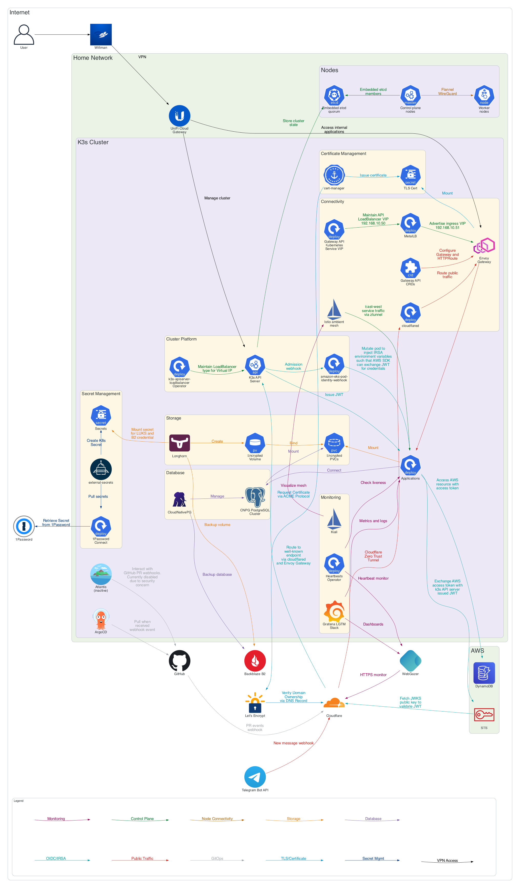

# otaru


[](https://github.com/siutsin/otaru/actions/workflows/github-code-scanning/codeql)
[](https://github.com/siutsin/otaru/actions/workflows/delete-untagged-images.yaml)
[](https://github.com/siutsin/otaru/actions/workflows/dependabot/dependabot-updates)
[](https://github.com/siutsin/otaru/actions/workflows/publish-healthcheck.yaml)
[](https://github.com/siutsin/otaru/actions/workflows/publish-kubernetes-service-patcher.yaml)
[](https://github.com/siutsin/otaru/actions/workflows/tfsec.yml)

> Over-Engineering at Its Finest.

Bare-Metal Home Lab for Kubernetes and Technical Playground.

<!-- TOC -->
* [otaru](#otaru)
  * [Architecture](#architecture)
  * [Hardware](#hardware)
  * [Cluster Components](#cluster-components)
  * [IaaS, PaaS, and SaaS](#iaas-paas-and-saas)
  * [Bootstrap Cluster](#bootstrap-cluster)
  * [Oopsy](#oopsy)
  * [Repository Configuration](#repository-configuration)
<!-- TOC -->

## Architecture



## Hardware

| ID             | Device                              | HAT                                                                                                                                                                                                            | Role   | /dev/mmcblk0                | /dev/nvme0n1                                    |
|----------------|-------------------------------------|----------------------------------------------------------------------------------------------------------------------------------------------------------------------------------------------------------------|--------|-----------------------------|-------------------------------------------------|
| etcd           | Intel NUC Mini PC Core i3-3217U 8GB | -                                                                                                                                                                                                              | -      | -                           | -                                               |
| raspberrypi-00 | Raspberry Pi 4 Model B 8GB          | [Waveshare PoE HAT (B)](https://thepihut.com/products/power-over-ethernet-hat-for-raspberry-pi-4-3b)                                                                                                           | Master | SanDisk Max Endurance 32 GB | -                                               |
| raspberrypi-01 | Raspberry Pi 4 Model B 8GB          | [Waveshare PoE HAT (B)](https://thepihut.com/products/power-over-ethernet-hat-for-raspberry-pi-4-3b)                                                                                                           | Master | SanDisk Max Endurance 32 GB | -                                               |
| raspberrypi-02 | Raspberry Pi 4 Model B 8GB          | [Waveshare PoE HAT (B)](https://thepihut.com/products/power-over-ethernet-hat-for-raspberry-pi-4-3b)                                                                                                           | Master | SanDisk Max Endurance 32 GB | -                                               |
| raspberrypi-03 | Raspberry Pi 5 8GB                  | [Waveshare PoE HAT (F)](https://thepihut.com/products/poe-hat-for-raspberry-pi-5-with-cooling-fan) + [Pineberry Pi HatDrive! Bottom](https://pineberrypi.com/products/hatdrive-bottom-2230-2242-2280-for-rpi5) | Master | SanDisk Max Endurance 32 GB | Samsung 980 PRO NVMe™ M.2 SSD 2TB (MZ-V8P2T0BW) |

## Cluster Components

| Category     | Name                                                                                                | Description                                                                                                             |
|--------------|-----------------------------------------------------------------------------------------------------|-------------------------------------------------------------------------------------------------------------------------|
| Application  | [Blocky](https://0xerr0r.github.io/blocky/latest/)                                                  | Stateless Ad and tracker-blocking DNS server                                                                            |
| Application  | [CyberChef](https://github.com/gchq/CyberChef)                                                      | The Cyber Swiss Army Knife by GCHQ                                                                                      |
| Application  | [Home Assistant](https://www.home-assistant.io/)                                                    | Home Automation                                                                                                         |
| Application  | [JSON Crack](https://github.com/AykutSarac/jsoncrack.com)                                           | JSON, YAML, etc. visualizer and editor                                                                                  |
| Application  | [Kubernetes Service Patcher](helm-charts/kubernetes-service-patcher)                                | An operator to update the `kubernetes` service type to `LoadBalancer`.                                                  |
| Application  | [冗PowerBot](https://github.com/siutsin/telegram-jung2-bot)                                          | Telegram bot tracks and counts individual message counts in groups.                                                     |
| CI/CD        | [Argo CD](https://github.com/argoproj/argo-cd)                                                      | GitOps, drift detection, and reconciliation                                                                             |
| CI/CD        | [Atlantis](https://github.com/runatlantis/atlantis)                                                 | Terraform Pull Request Automation                                                                                       |
| Connectivity | [Cilium Gateway](helm-charts/cilium-gateway)                                                        | Cilium Ingress Controller with Virtual IP Layer 2 announcement and TLS termination                                      |
| Connectivity | [Cilium](https://cilium.io/)                                                                        | Cilium is a networking, observability, and security solution with an eBPF-based dataplane                               |
| Connectivity | [Cloudflare Tunnel](https://developers.cloudflare.com/cloudflare-one/connections/connect-networks/) | Cloudflare Zero Trust Edge                                                                                              |
| Connectivity | [Gateway API Kubernetes](helm-charts/gateway-api-kubernetes)                                        | Virtual IP and Layer 2 announcement for `kubernetes` service's External IP                                              |
| Connectivity | [Gateway API](https://gateway-api.sigs.k8s.io/)                                                     | Kubernetes standard CRDs for managing network traffic.                                                                  |
| Connectivity | [httpbin](https://github.com/Kong/httpbin)                                                          | Generic health check service                                                                                            |
| Monitoring   | [Grafana](https://github.com/grafana/grafana)                                                       | Grafana LGTM Stack. Visualisation dashboards                                                                            |
| Monitoring   | [Kubernetes Metrics Server](https://github.com/kubernetes-sigs/metrics-server)                      | Scalable, efficient source of container resource metrics for Kubernetes built-in autoscaling pipelines                  |
| Monitoring   | [Loki](https://github.com/grafana/loki)                                                             | Grafana LGTM Stack. Log aggregation system with Promtail for log discovery                                              |
| Monitoring   | [Prometheus](https://github.com/prometheus/prometheus)                                              | Systems and service monitoring tool that collects metrics.                                                              |
| Scheduling   | [Descheduler](https://github.com/kubernetes-sigs/descheduler)                                       | Evicts pods for optimal cluster node utilisation                                                                        |
| Scheduling   | [KEDA](https://keda.sh/)                                                                            | Event Driven Autoscaler                                                                                                 |
| Scheduling   | [Reloader](https://github.com/stakater/Reloader)                                                    | Watch changes in ConfigMap and Secret and do rolling upgrades                                                           |
| Security     | [1Password Connect](https://github.com/1Password/connect)                                           | Proxy service for 1Password; acts as a secret provider                                                                  |
| Security     | [External Secrets Operator](https://github.com/external-secrets/external-secrets)                   | Extracts secrets from a secret provider                                                                                 |
| Security     | [cert-manager](https://github.com/cert-manager/cert-manager)                                        | Manages TLS certificates via Let's Encrypt and ACME protocol                                                            |
| Security     | [Falco](https://github.com/falcosecurity/falco)                                                     | Cloud-native runtime security tool to detect and alert on abnormal behavior and potential security threats in real-time |
| Storage      | [Longhorn](https://github.com/longhorn/longhorn)                                                    | Distributed block storage system; backup and restore from/to remote destinations                                        |

## IaaS, PaaS, and SaaS

| Category     | Name            | Service                                                                                    | Description               |
|--------------|-----------------|--------------------------------------------------------------------------------------------|---------------------------|
| CI/CD        | Github          | [Actions](https://github.com/features/actions)                                             | Run Terragrunt            |
| Connectivity | Cloudflare      | [Access](https://developers.cloudflare.com/cloudflare-one/policies/access/)                | Edge Access Control       |
| Connectivity | Cloudflare      | [DNS](https://developers.cloudflare.com/dns/)                                              | Authoritative DNS Service |
| Connectivity | Cloudflare      | [Tunnel](https://developers.cloudflare.com/cloudflare-one/connections/connect-networks/)   | Edge Connectivity         |
| Connectivity | Cloudflare      | [WARP](https://developers.cloudflare.com/cloudflare-one/connections/connect-devices/warp/) | VPN to Internal Network   |
| Monitoring   | Healthchecks.io | [Healthchecks.io](https://healthchecks.io/)                                                | Health Check - Heartbeat  |
| Monitoring   | UptimeRobot     | [UptimeRobot](https://uptimerobot.com/)                                                    | Health Check              |
| Security     | 1Password       | [Connect](https://developer.1password.com/docs/connect/)                                   | Secrets Automation        |
| Security     | Let's Encrypt   | [Let's Encrypt](https://letsencrypt.org/)                                                  | Certificate Authority     |
| Storage      | AWS             | [S3](https://aws.amazon.com/s3/)                                                           | Terraform Remote State    |
| Storage      | Backblaze       | [B2](https://www.backblaze.com/cloud-storage)                                              | Volume Backup             |

## Bootstrap Cluster

1. **Install Tooling**
    ```shell
    brew install ansible cilium go-jsonnet helm kubectl terraform terragrunt && ansible-galaxy collection install -r ansible/requirements.yaml
    ```
2. **Add SSH Keys to `known_hosts`**
    ```shell
    for i in {60..63}; do ssh-keygen -R "192.168.1.$i"; done && for i in {60..63}; do ssh-keyscan "192.168.1.$i" >> ~/.ssh/known_hosts; done
    ```
3. **Set Up 1Password Credentials**

   Follow the [1Password Connect Doc](https://developer.1password.com/docs/connect/get-started/#step-2-deploy-1password-connect-server) to create `1password-credentials.json` and
   save the access token to the file `token`.

    ```shell
    ❯ tree $(pwd) -L 1
    /path/to/project/otaru
    ├── 1password-credentials.json
    ├── 1password-credentials.json.sample
    ├── ...
    ├── token
    └── token.sample
    ```

4. **Bootstrap Cluster**
    ```shell
    make
    ```

## Oopsy

Update host packages and reboot the entire cluster.

```shell
make maintenance
```

Upgrade k3s kubernetes version and restart workloads.

```shell
make upgrade-cluster
```

Wipe everything and start from scratch.

```shell
make nuke-cluster
```

Rebuild the cluster.

```shell
make build-cluster
```

Restart all workloads.

```shell
make restart-all
```

Generate atlantis.yaml.

```shell
make generate-atlantis-yaml
```

## Repository Configuration

<details>
<summary>Secrets for GitHub Actions</summary>

| Key                             |
|---------------------------------|
| GH_DELETE_UNTAGGED_IMAGES_TOKEN |

</details>
