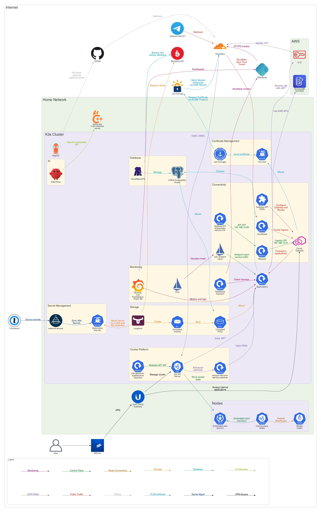

# otaru


[](https://www.webgazer.io/s?id=493)

> Over-Engineering at Its Finest

Bare-metal `k3s` home lab and technical playground.

The only rule: Raspberry Pi 🍓. Why? Why not ¯\\\_(ツ)\_/¯

## Architecture



Current cluster layout:

- Dedicated `192.168.10.0/24` VLAN for cluster nodes and service virtual IPs
- `k3s` with embedded etcd on three control-plane nodes
- Flannel `wireguard-native` for pod networking
- MetalLB + Envoy Gateway for service and ingress virtual IPs, with the Envoy Gateway controller in `envoy-gateway-system` and the ingress proxy in `gateway`
- Istio ambient mesh with Kiali for service mesh observability
- `kube-scheduler` bin-packs via `NodeResourcesFit`/`MostAllocated`,
  paired with Descheduler's `HighNodeUtilization` profile, to
  concentrate free memory onto one node instead of spreading it too
  thin for larger pods to fit anywhere (see `documentation/gotcha.md`)

## Hardware


<!-- markdownlint-disable MD060 -->
| Node              | Device                                                         | Role           | Storage                                |
|-------------------|----------------------------------------------------------------|----------------|----------------------------------------|
| `raspberrypi-00`  | [Raspberry Pi 5 8GB][rpi5]                                     | Control plane  | [Lexar NM620 256GB][lexar-nm620]       |
| `raspberrypi-01`  | Raspberry Pi 5 8GB                                             | Control plane  | [Crucial P3 Plus 4TB][crucial-p3-plus] |
| `raspberrypi-02`  | Raspberry Pi 5 8GB                                             | Control plane  | Crucial P3 Plus 4TB                    |
| `raspberrypi-03`  | Raspberry Pi 5 8GB                                             | Worker         | [Crucial P2 500GB][crucial-p2]         |
| `nuc-00`[^nuc-00] | [Intel NUC Mini PC Core i3-3217U DC3217IYE 8GB][intel-nuc-8gb] | Worker         | 64 GB SSD                              |
| `ucg-ultra`       | [UniFi Cloud Gateway Ultra][ucg-ultra]                         | Router/Gateway | -                                      |
| `usw-ultra`       | [UniFi Switch Ultra][usw-ultra]                                | PoE switch     | -                                      |
| `rackmate-t1`     | [GeeekPi DeskPi RackMate T1][rackmate-t1]                      | Rack enclosure | -                                      |
| `rack-mount`      | [GeeekPi 10" 2U Rack Mount][rack-mount]                        | Pi rack mount  | -                                      |
<!-- markdownlint-enable MD060 -->

[^nuc-00]: Yes, yes, I know I said Raspberry Pi only, but have you seen Raspberry
    Pi 5 prices lately? ¯\\\_(ツ)\_/¯ This is a temporary worker node until the
    damage-to-wallet ratio improves.

Three nodes form the control plane. Two nodes remain workers, including temporary `nuc-00`.

## Network Layout

| IP              | Role                 |
|-----------------|----------------------|
| `192.168.10.1`  | VLAN gateway         |
| `192.168.10.50` | Kubernetes API VIP   |
| `192.168.10.51` | Internal ingress VIP |
| `192.168.10.60` | `raspberrypi-00`     |
| `192.168.10.61` | `raspberrypi-01`     |
| `192.168.10.62` | `raspberrypi-02`     |
| `192.168.10.63` | `raspberrypi-03`     |
| `192.168.10.80` | `nuc-00`             |

[lexar-nm620]: https://www.lexar.com/global/products/Lexar-NM620-M-2-2280-NVMe-SSD/
[crucial-p3-plus]: https://www.crucial.com/ssd/p3-plus/ct4000p3pssd8
[crucial-p2]: https://www.ssdwiki.com/m-2-pci-express/crucial-p2/
[intel-nuc-8gb]: https://www.intel.com/content/www/us/en/products/sku/71275/intel-nuc-kit-dc3217iye/specifications.html
[rackmate-t1]: https://www.amazon.co.uk/dp/B0CS6MHCY8
[rack-mount]: https://www.amazon.co.uk/dp/B0DRGF68Z9
[ucg-ultra]: https://uk.store.ui.com/uk/en/category/cloud-gateways-compact/products/ucg-ultra
[rpi5]: https://thepihut.com/products/raspberry-pi-5?src=raspberrypi&variant=42531604955331
[usw-ultra]: https://uk.store.ui.com/uk/en/category/switching-utility/collections/pro-ultra/products/usw-ultra

## Cluster Components

<!-- markdownlint-disable MD060 -->
| Category     | Name                                                                                                | Description                                                                                                                                                             |
|--------------|-----------------------------------------------------------------------------------------------------|-------------------------------------------------------------------------------------------------------------------------------------------------------------------------|
| Application  | [Blocky](https://0xerr0r.github.io/blocky/latest/)                                                  | Stateless DNS server                                                                                                                                                    |
| Application  | [changedetection.io](https://github.com/dgtlmoon/changedetection.io)                                | Self-hosted website change detection and alerting                                                                                                                       |
| Application  | [CyberChef](https://github.com/gchq/CyberChef)                                                      | The Cyber Swiss Army Knife by GCHQ                                                                                                                                      |
| Application  | [Excalidraw](https://github.com/excalidraw/excalidraw)                                              | Virtual whiteboard for sketching hand-drawn like diagrams                                                                                                               |
| Application  | [Home Assistant](https://www.home-assistant.io/)                                                    | Home automation                                                                                                                                                         |
| Application  | [JSON Crack](https://github.com/AykutSarac/jsoncrack.com)                                           | JSON, YAML, etc. visualizer and editor                                                                                                                                  |
| Application  | [Kubernetes MCP Server](https://github.com/containers/kubernetes-mcp-server)                        | Model Context Protocol server for Kubernetes cluster operations                                                                                                         |
| Application  | [OpenClaw](helm-charts/openclaw)                                                                    | Self-hosted AI agent runtime with local model integration                                                                                                               |
| Application  | [TeslaMate](https://github.com/teslamate-org/teslamate/)                                            | Self-hosted data logger for Tesla                                                                                                                                       |
| Application  | [Umami](https://umami.is/)                                                                          | Self-hosted web analytics                                                                                                                                               |
| Application  | [冗PowerBot](https://github.com/siutsin/telegram-jung2-bot)                                          | Telegram bot tracks and counts individual message counts in groups                                                                                                      |
| CI/CD        | [Argo CD](https://github.com/argoproj/argo-cd)                                                      | GitOps, drift detection, and reconciliation                                                                                                                             |
| Connectivity | [Cloudflare Tunnel](https://developers.cloudflare.com/cloudflare-one/connections/connect-networks/) | Cloudflare Zero Trust edge                                                                                                                                              |
| Connectivity | [CoreDNS](https://github.com/coredns/coredns)                                                       | Cluster DNS managed separately from the disabled bundled k3s add-on                                                                                                     |
| Connectivity | [Envoy Gateway](helm-charts/envoy-gateway)                                                          | Gateway API ingress controller with controller in `envoy-gateway-system` and proxy in `gateway`; TCP/HTTP ingress can use the mesh path, UDP remains outside Istio mTLS |
| Connectivity | [Flannel](https://github.com/flannel-io/flannel)                                                    | `wireguard-native` encrypted pod networking for `k3s`                                                                                                                   |
| Connectivity | [Gateway API](https://gateway-api.sigs.k8s.io/)                                                     | Kubernetes standard CRDs for managing network traffic                                                                                                                   |
| Connectivity | [httpbin](https://github.com/Kong/httpbin)                                                          | Generic echo server for health checks                                                                                                                                   |
| Connectivity | [Istio](helm-charts/istio-base)                                                                     | Service mesh control plane and ambient dataplane (`istiod`, `istio-cni`, `ztunnel`)                                                                                     |
| Connectivity | [k3s-apiserver-loadbalancer](https://github.com/siutsin/k3s-apiserver-loadbalancer)                 | Operator that keeps the `kubernetes` service exposed as a `LoadBalancer`                                                                                                |
| Connectivity | [MetalLB](helm-charts/metallb)                                                                      | Bare metal `LoadBalancer` implementation for service virtual IP allocation and L2 advertisement                                                                         |
| Database     | [CloudNativePG](https://github.com/cloudnative-pg/cloudnative-pg)                                   | A Kubernetes operator that manages PostgreSQL clusters                                                                                                                  |
| Database     | [CloudNativePG Barman Cloud Plugin](helm-charts/cloudnative-pg-plugin-barman-cloud)                 | Backup plugin for CloudNativePG                                                                                                                                         |
| Monitoring   | [Fluent Bit](helm-charts/monitoring)                                                                | Node log collection and shipping to Loki                                                                                                                                |
| Monitoring   | [Grafana](helm-charts/monitoring)                                                                   | Dashboards and visualization for cluster metrics and logs                                                                                                               |
| Monitoring   | [Heartbeats](helm-charts/heartbeats)                                                                | Kubernetes operator for heartbeat monitoring                                                                                                                            |
| Monitoring   | [Kiali](helm-charts/kiali)                                                                          | Service mesh observability UI for Istio                                                                                                                                 |
| Monitoring   | [Kubernetes Metrics Server](https://github.com/kubernetes-sigs/metrics-server)                      | Scalable, efficient source of container resource metrics for Kubernetes built-in autoscaling pipelines                                                                  |
| Monitoring   | [Loki](helm-charts/monitoring)                                                                      | Log aggregation and query backend                                                                                                                                       |
| Monitoring   | [Prometheus](helm-charts/monitoring)                                                                | Metrics collection and query backend                                                                                                                                    |
| Scheduling   | [Descheduler](https://github.com/kubernetes-sigs/descheduler)                                       | Evicts pods for optimal cluster node utilisation; runs a `HighNodeUtilization` profile to consolidate the least-loaded node's pods elsewhere                           |
| Scheduling   | [k8s-cleaner](https://github.com/gianlucam76/k8s-cleaner)                                           | Automated failed pod cleanup and periodic workload repaving                                                                                                             |
| Scheduling   | [KEDA](https://keda.sh/)                                                                            | Event Driven Autoscaler                                                                                                                                                 |
| Scheduling   | [Reloader](https://github.com/stakater/Reloader)                                                    | Watch changes in ConfigMap and Secret and do rolling upgrades                                                                                                           |
| Security     | [1Password Connect](https://github.com/1Password/connect)                                           | Proxy service for 1Password; acts as a secret provider                                                                                                                  |
| Security     | [amazon-eks-pod-identity-webhook](https://github.com/aws/amazon-eks-pod-identity-webhook)           | Amazon EKS Pod Identity Webhook for IRSA in bare metal Kubernetes clusters                                                                                              |
| Security     | [cert-manager](https://github.com/cert-manager/cert-manager)                                        | Manages TLS certificates via Let's Encrypt and ACME protocol                                                                                                            |
| Security     | [External Secrets Operator](https://github.com/external-secrets/external-secrets)                   | Extracts secrets from a secret provider                                                                                                                                 |
| Security     | [Kyverno](https://github.com/kyverno/kyverno)                                                       | Kubernetes policy engine                                                                                                                                                |
| Security     | [oidc-provider](helm-charts/oidc-provider)                                                          | Kubernetes OIDC provider and JWKS endpoint                                                                                                                              |
| Storage      | [Longhorn](https://github.com/longhorn/longhorn)                                                    | Distributed block storage system; backup and restore from/to remote destinations                                                                                        |
<!-- markdownlint-enable MD060 -->

## IaaS, PaaS, and SaaS

<!-- markdownlint-disable MD060 -->
| Category     | Name          | Service                                                                                  | Description                                  |
|--------------|---------------|------------------------------------------------------------------------------------------|----------------------------------------------|
| CI/CD        | Anthropic     | [Claude Code](https://www.anthropic.com/claude-code)                                     | AI code review                               |
| CI/CD        | OpenAI        | [Codex](https://openai.com/codex/)                                                       | AI code review                               |
| CI/CD        | GitHub        | [Actions](https://github.com/features/actions)                                           | Repository validation and release automation |
| CI/CD        | Renovate      | [Dependency Updates](https://docs.renovatebot.com/)                                      | Automated dependency maintenance             |
| Connectivity | Cloudflare    | [Access](https://developers.cloudflare.com/cloudflare-one/policies/access/)              | Edge access control                          |
| Connectivity | Cloudflare    | [DNS](https://developers.cloudflare.com/dns/)                                            | Authoritative DNS service                    |
| Connectivity | Cloudflare    | [Tunnel](https://developers.cloudflare.com/cloudflare-one/connections/connect-networks/) | Edge connectivity                            |
| Connectivity | UniFi         | [Network](https://ui.com/)                                                               | Gateway, VLAN, WLAN, and firewall management |
| Messaging    | Telegram      | [Bot API](https://core.telegram.org/bots/api)                                            | Bot messaging for OpenClaw and 冗PowerBot     |
| Monitoring   | Heartbeats    | [Heartbeats Operator](helm-charts/heartbeats)                                            | Kubernetes operator for heartbeat monitoring |
| Monitoring   | WebGazer      | [Uptime Monitoring](https://www.webgazer.io/)                                            | Health check                                 |
| Security     | 1Password     | [Connect](https://developer.1password.com/docs/connect/)                                 | Secrets automation                           |
| Security     | AWS           | [IAM](https://aws.amazon.com/iam/)                                                       | OIDC/IRSA permissions and token exchange     |
| Security     | Let's Encrypt | [Let's Encrypt](https://letsencrypt.org/)                                                | Certificate authority                        |
| Security     | Snyk          | [Snyk](https://app.snyk.io/)                                                             | Vulnerability detection                      |
| Storage      | AWS           | [DynamoDB](https://aws.amazon.com/dynamodb/)                                             | Database backend for 冗PowerBot               |
| Storage      | AWS           | [SQS](https://aws.amazon.com/sqs/)                                                       | Queue backend for 冗PowerBot                  |
| Storage      | AWS           | [S3](https://aws.amazon.com/s3/)                                                         | OpenTofu remote state                        |
| Storage      | Backblaze     | [B2](https://www.backblaze.com/cloud-storage)                                            | Longhorn and CloudNativePG backups           |
<!-- markdownlint-enable MD060 -->

## Cluster Bootstrap

1. **Install Tooling**

    ```shell
    brew install \
      ansible \
      direnv \
      editorconfig-checker \
      gh \
      go-jsonnet \
      helm \
      jq \
      kubectl \
      markdownlint-cli2 \
      opentofu \
      terragrunt \
      yq \
      zizmor
    ```

2. **Configure Tooling**

    Authenticate the GitHub CLI before Terraform/Terragrunt or Helm OCI
    dependency updates need GitHub access.

    ```shell
    gh auth login
    ```

3. **Add SSH Keys to `known_hosts`**

    ```shell
    KH=~/.ssh/known_hosts && touch "$KH" && for ip in 192.168.10.{60..63}; do ssh-keygen -f "$KH" -R "$ip"; ssh-keyscan "$ip" >> "$KH"; done
    ```

4. **Set Up Service Credentials**

    Create the local files documented in [Secrets](documentation/secrets.md)
    before running cluster bootstrap. Keep actual credentials outside this repo.

5. **Bootstrap Cluster**

    ```shell
    make setup
    ```

## Oopsy

Update host packages and reboot the entire cluster.

```shell
make maintenance
```

Upgrade the `k3s` Kubernetes version and restart workloads.

```shell
make upgrade
```

Unlock a LUKS node after boot.

```shell
make unlock <node-name>
```

Wipe everything and start from scratch.

```shell
make nuke
```

Set up Raspberry Pi nodes and the `k3s` cluster.

```shell
make setup
```
