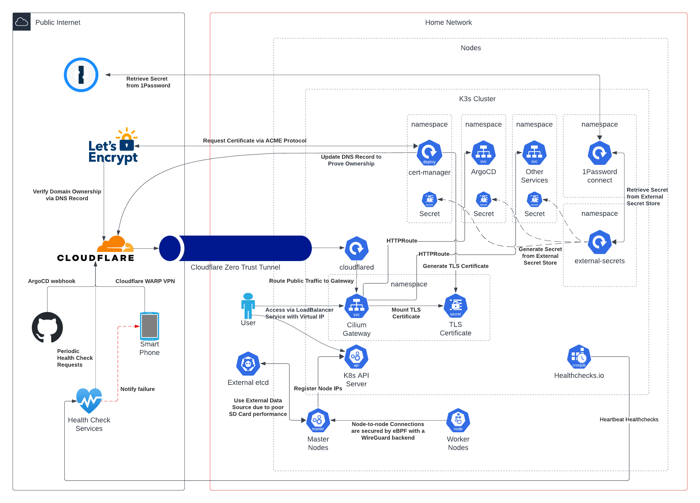

# otaru


[](https://www.webgazer.io/s?id=493)

> Over-Engineering at Its Finest.

Bare-Metal Home Lab for Kubernetes and Technical Playground.

## Architecture



## Hardware


| Device                              | Description                                                                                                                 | /dev/mmcblk0                | /dev/nvme0n1                                    |
|-------------------------------------|-----------------------------------------------------------------------------------------------------------------------------|-----------------------------|-------------------------------------------------|
| Intel NUC Mini PC Core i3-3217U 8GB | etcd                                                                                                                        | -                           | -                                               |
| Raspberry Pi 4 Model B 8GB          | raspberry-00 Node with [Waveshare PoE HAT (B)](https://thepihut.com/products/power-over-ethernet-hat-for-raspberry-pi-4-3b) | SanDisk Max Endurance 32 GB | -                                               |
| Raspberry Pi 4 Model B 8GB          | raspberry-01 Node with [Waveshare PoE HAT (B)](https://thepihut.com/products/power-over-ethernet-hat-for-raspberry-pi-4-3b) | SanDisk Max Endurance 32 GB | -                                               |
| Raspberry Pi 4 Model B 8GB          | raspberry-02 Node with [Waveshare PoE HAT (B)](https://thepihut.com/products/power-over-ethernet-hat-for-raspberry-pi-4-3b) | SanDisk Max Endurance 32 GB | -                                               |
| Raspberry Pi 5 8GB                  | raspberry-03 Node with [Waveshare PoE HAT (F)](https://thepihut.com/products/poe-hat-for-raspberry-pi-5-with-cooling-fan)   | SanDisk Max Endurance 32 GB | Samsung 980 PRO NVMe™ M.2 SSD 2TB (MZ-V8P2T0BW) |
| UniFi Switch Ultra                  | PoE Switch                                                                                                                  | -                           | -                                               |
| GeeekPi 10" 2U Rack Mount           | Rack Mount for Raspberry Pi with PCIe to M.2 NVMe Adapters                                                                  | -                           | -                                               |

## Cluster Components

<!-- markdownlint-disable MD060 -->
| Category     | Name                                                                                                | Description                                                                                                             |
|--------------|-----------------------------------------------------------------------------------------------------|-------------------------------------------------------------------------------------------------------------------------|
| Application  | [Blocky](https://0xerr0r.github.io/blocky/latest/)                                                  | Stateless DNS server                                                                                                    |
| Application  | [CyberChef](https://github.com/gchq/CyberChef)                                                      | The Cyber Swiss Army Knife by GCHQ                                                                                      |
| Application  | [Excalidraw](https://github.com/excalidraw/excalidraw)                                              | Virtual whiteboard for sketching hand-drawn like diagrams                                                               |
| Application  | [Home Assistant](https://www.home-assistant.io/)                                                    | Home Automation                                                                                                         |
| Application  | [JSON Crack](https://github.com/AykutSarac/jsoncrack.com)                                           | JSON, YAML, etc. visualizer and editor                                                                                  |
| Application  | [TeslaMate](https://github.com/teslamate-org/teslamate/)                                            | Self-hosted data logger for Tesla                                                                                       |
| Application  | [Yaade](https://github.com/EsperoTech/yaade)                                                        | Open-source, self-hosted, and collaborative API development environment                                                 |
| Application  | [k3s-apiserver-loadbalancer](https://github.com/siutsin/k3s-apiserver-loadbalancer)                 | An operator to update the `kubernetes` service type to `LoadBalancer`                                                   |
| Application  | [冗PowerBot](https://github.com/siutsin/telegram-jung2-bot)                                          | Telegram bot tracks and counts individual message counts in groups                                                      |
| CI/CD        | [Argo CD](https://github.com/argoproj/argo-cd)                                                      | GitOps, drift detection, and reconciliation                                                                             |
| CI/CD        | [Atlantis](https://github.com/runatlantis/atlantis)                                                 | OpenTofu Pull Request Automation                                                                                        |
| Connectivity | [Cilium Gateway](helm-charts/cilium-gateway)                                                        | Cilium Ingress Controller with Virtual IP Layer 2 announcement and TLS termination                                      |
| Connectivity | [Cilium](https://cilium.io/)                                                                        | Cilium is a networking, observability, and security solution with an eBPF-based dataplane                               |
| Connectivity | [Cloudflare Tunnel](https://developers.cloudflare.com/cloudflare-one/connections/connect-networks/) | Cloudflare Zero Trust Edge                                                                                              |
| Connectivity | [Gateway API Kubernetes](helm-charts/gateway-api-kubernetes)                                        | Virtual IP and Layer 2 announcement for `kubernetes` service's External IP                                              |
| Connectivity | [Gateway API](https://gateway-api.sigs.k8s.io/)                                                     | Kubernetes standard CRDs for managing network traffic                                                                   |
| Connectivity | [httpbin](https://github.com/Kong/httpbin)                                                          | Generic health check service                                                                                            |
| Database     | [CloudNativePG Barman Cloud Plugin](helm-charts/cloudnative-pg-plugin-barman-cloud)                 | PostgreSQL backup plugin for cloud storage providers                                                                    |
| Database     | [CloudNativePG Clusters](helm-charts/cloudnative-pg-clusters)                                       | Multi-cluster PostgreSQL management with B2 backup integration                                                          |
| Database     | [CloudNativePG](https://github.com/cloudnative-pg/cloudnative-pg)                                   | A Kubernetes operator that manages PostgreSQL clusters                                                                  |
| Monitoring   | [Grafana](https://github.com/grafana/grafana)                                                       | Grafana LGTM Stack. Visualisation dashboards                                                                            |
| Monitoring   | [Kubernetes Metrics Server](https://github.com/kubernetes-sigs/metrics-server)                      | Scalable, efficient source of container resource metrics for Kubernetes built-in autoscaling pipelines                  |
| Monitoring   | [Monitoring Stack](helm-charts/monitoring)                                                          | Complete monitoring stack with Grafana, Prometheus, and Loki                                                            |
| Scheduling   | [Descheduler](https://github.com/kubernetes-sigs/descheduler)                                       | Evicts pods for optimal cluster node utilisation                                                                        |
| Scheduling   | [KEDA](https://keda.sh/)                                                                            | Event Driven Autoscaler                                                                                                 |
| Scheduling   | [Reloader](https://github.com/stakater/Reloader)                                                    | Watch changes in ConfigMap and Secret and do rolling upgrades                                                           |
| Security     | [1Password Connect](https://github.com/1Password/connect)                                           | Proxy service for 1Password; acts as a secret provider                                                                  |
| Security     | [External Secrets Operator](https://github.com/external-secrets/external-secrets)                   | Extracts secrets from a secret provider                                                                                 |
| Security     | [Falco](https://github.com/falcosecurity/falco)                                                     | Cloud-native runtime security tool to detect and alert on abnormal behavior and potential security threats in real-time |
| Security     | [amazon-eks-pod-identity-webhook](https://github.com/aws/amazon-eks-pod-identity-webhook)           | Amazon EKS Pod Identity Webhook for IRSA in bare metal Kubernetes clusters                                              |
| Security     | [cert-manager](https://github.com/cert-manager/cert-manager)                                        | Manages TLS certificates via Let's Encrypt and ACME protocol                                                            |
| Security     | [oidc-provider](helm-charts/oidc-provider)                                                          | Kubernetes OIDC provider and JWKS endpoint                                                                              |
| Security     | [zizmor](https://docs.zizmor.sh/)                                                                   | Static analysis for GitHub Actions                                                                                      |
| Storage      | [Longhorn Config](helm-charts/longhorn-config)                                                      | Longhorn configuration and recurring jobs                                                                               |
| Storage      | [Longhorn Volume Lib](helm-charts/longhorn-volume-lib)                                              | Reusable volume templates for Longhorn storage                                                                          |
| Storage      | [Longhorn](https://github.com/longhorn/longhorn)                                                    | Distributed block storage system; backup and restore from/to remote destinations                                        |
<!-- markdownlint-enable MD060 -->

## IaaS, PaaS, and SaaS

| Category     | Name          | Service                                                                                    | Description                                  |
|--------------|---------------|--------------------------------------------------------------------------------------------|----------------------------------------------|
| CI/CD        | Github        | [Actions](https://github.com/features/actions)                                             | Run Terragrunt                               |
| CI/CD        | Sourcery      | [AI Code Reviews](https://docs.sourcery.ai/)                                               | Instant feedback for Pull Requests           |
| Connectivity | Cloudflare    | [Access](https://developers.cloudflare.com/cloudflare-one/policies/access/)                | Edge Access Control                          |
| Connectivity | Cloudflare    | [DNS](https://developers.cloudflare.com/dns/)                                              | Authoritative DNS Service                    |
| Connectivity | Cloudflare    | [Tunnel](https://developers.cloudflare.com/cloudflare-one/connections/connect-networks/)   | Edge Connectivity                            |
| Connectivity | Cloudflare    | [WARP](https://developers.cloudflare.com/cloudflare-one/connections/connect-devices/warp/) | VPN to Internal Network                      |
| Monitoring   | Heartbeats    | [Heartbeats Operator](helm-charts/heartbeats)                                              | Kubernetes operator for heartbeat monitoring |
| Monitoring   | WebGazer      | [Uptime Monitoring](https://www.webgazer.io/)                                              | Health Check                                 |
| Security     | 1Password     | [Connect](https://developer.1password.com/docs/connect/)                                   | Secrets Automation                           |
| Security     | Let's Encrypt | [Let's Encrypt](https://letsencrypt.org/)                                                  | Certificate Authority                        |
| Security     | Snyk          | [Snyk](https://app.snyk.io/)                                                               | Detects vulnerabilities                      |
| Storage      | AWS           | [S3](https://aws.amazon.com/s3/)                                                           | OpenTofu Remote State                        |
| Storage      | Backblaze     | [B2](https://www.backblaze.com/cloud-storage)                                              | Volume Backup                                |

## Bootstrap Cluster

1. **Install Tooling**

    ```shell
    brew install \
      ansible \
      cilium \
      direnv \
      go-jsonnet \
      helm \
      kubectl \
      opentofu \
      terragrunt \
      && ansible-galaxy collection install -r ansible/requirements.yaml
    ```

2. **Add SSH Keys to `known_hosts`**

    ```shell
    for i in {60..63}; do ssh-keygen -R "192.168.1.$i"; done && for i in {60..63}; do ssh-keyscan "192.168.1.$i" >> ~/.ssh/known_hosts; done
    ```

3. **Set Up Service Credentials**

    Follow the [1Password Connect Doc](https://developer.1password.com/docs/connect/get-started/#step-2-deploy-1password-connect-server) to create `1password-credentials.json` and
    save the access token to the file `token`. Additionally, save your AWS Account ID to the file `argocd-secret`.
    Copy `.envrc.sample` to `.envrc` and fill in the required environment variables for Terragrunt and OpenTofu.

    ```shell
    ❯ tree $(pwd) -L 1
    /path/to/project/otaru
    ├── .envrc
    ├── .envrc.sample
    ├── 1password-credentials.json
    ├── 1password-credentials.json.sample
    ├── ...
    ├── argocd-secret
    ├── argocd-secret.sample
    ├── ...
    ├── token
    └── token.sample
    ```

4. **Bootstrap Cluster**

    ```shell
    make setup-cluster
    ```

## Oopsy

Update host packages and reboot the entire cluster.

```shell
make maintenance
```

Upgrade k3s kubernetes version and restart workloads.

```shell
make upgrade-cluster
```

Wipe everything and start from scratch.

```shell
make nuke-cluster
```

Rebuild the cluster.

```shell
make build-cluster
```

Restart all workloads.

```shell
make restart-all
```

Generate atlantis.yaml.

```shell
make generate-atlantis-yaml
```
