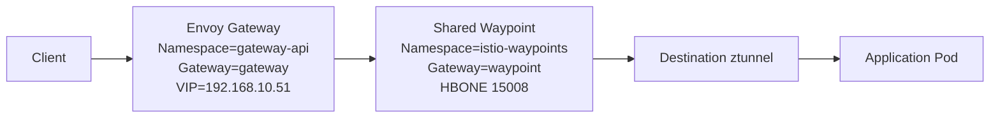
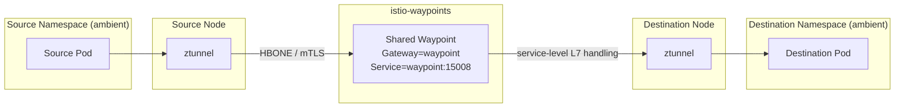

# Istio Connectivity

Current state as of `2026-05-03`:

- Istio runs in ambient mode
- most application namespaces are ambient-enrolled
- one shared waypoint provides L7 handling for enrolled services
- that shared waypoint lives in `istio-waypoints`
- Envoy Gateway lives separately in `gateway-api`, which is explicitly kept out of ambient

## Components

- `istiod`: control plane in `istio-system`
- `istio-cni`: ambient redirection setup on nodes
- `ztunnel`: one pod per node for L4 ambient transport
- `waypoint`: shared Envoy waypoint in `istio-waypoints`
- `gateway`: Envoy Gateway load balancer in `gateway-api`

## Namespace Model

The cluster uses three connectivity roles:

- application namespaces: ambient-enrolled and configured to use the shared waypoint
- `istio-waypoints`: hosts the shared waypoint and stays outside ambient
- `gateway-api`: hosts Envoy Gateway and stays outside ambient

Some platform namespaces also stay outside ambient when they do not need the
ambient traffic path.

## North-South Connectivity

Traffic entering the cluster follows this path:

1. a client reaches the Envoy Gateway load balancer at `192.168.10.51`
2. Envoy Gateway matches a `Gateway` listener and `HTTPRoute`
3. if the destination service is ambient-enrolled, ingress traffic is sent through the shared waypoint
4. the destination node `ztunnel` forwards traffic to the target pod

### Current North-South Path

### Important Constraint

`gateway-api` must stay outside ambient.

If Envoy Gateway itself is ambient-enrolled, ingress can fail even while backend services are healthy. Observed failure mode:

- `503 upstream_reset_before_response_started{connection_termination}`

Therefore:

- the `gateway-api` namespace is `istio.io/dataplane-mode=none`
- the generated Envoy Gateway pods are also labeled `istio.io/dataplane-mode=none`

## East-West Connectivity

For ambient-enrolled services, the path is:

1. the source workload sends traffic normally
2. source node `ztunnel` captures it
3. traffic is forwarded over HBONE to the shared waypoint
4. the waypoint applies service-level L7 handling
5. traffic is forwarded toward the destination workload

### Current East-West Path

### What This Means

- L4 transport and mTLS come from `ztunnel`
- L7 policy and HTTP/gRPC telemetry come from the shared waypoint
- east-west traffic does not use sidecars
- the shared waypoint is the main L7 choke point for enrolled services

## Non-Ambient Connectivity

Workloads outside ambient do not use the ambient service path.

Current examples:

- `cert-manager`
- `external-secrets`
- `keda`
- `kyverno`
- `gateway-api`
- `istio-system`
- `istio-waypoints`

## Operational Consequences

- enrolled services get ambient L4 transport through `ztunnel`
- enrolled services get L7 visibility through the shared waypoint
- Kiali HTTP insights depend on traffic passing through the waypoint path
- the shared waypoint reduces resource usage compared with one waypoint per namespace
- the tradeoff is a shared L7 blast radius across many namespaces
