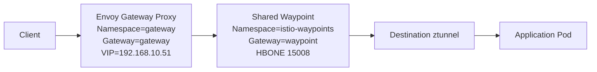
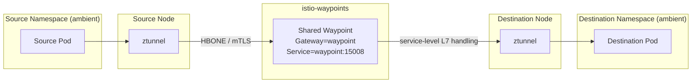

# Istio Connectivity

- Istio runs in ambient mode
- most application namespaces are ambient-enrolled
- one shared waypoint provides L7 handling for enrolled services
- that shared waypoint lives in `istio-waypoints`
- Envoy Gateway uses a split control plane and data plane

## Components

- `istiod`: control plane in `istio-system`
- `istio-cni`: ambient redirection setup on nodes
- `ztunnel`: one pod per node for L4 ambient transport, identity, and HBONE/mTLS
- `waypoint`: shared Envoy waypoint in `istio-waypoints` for L7 policy, routing, and HTTP/gRPC telemetry
- `envoy-gateway`: controller in `envoy-gateway-system`
- `gateway`: Envoy Gateway proxy in `gateway`
- `kiali`: observability UI in ambient

In sidecar mode, one Envoy sidecar did both jobs. In ambient mode, those roles
are split:

- `ztunnel`: secure L4 transport
- `waypoint`: L7 processing

The waypoint is still an ordinary Kubernetes proxy workload:

- it runs as ordinary Envoy pods
- Kubernetes can schedule those pods on any node
- it is reached through a normal Kubernetes `Service`

It is not the edge API gateway. In this cluster:

- `gateway` is the north-south ingress proxy
- `waypoint` is the internal east-west L7 proxy

## Namespace Model

Connectivity roles:

- application namespaces: ambient-enrolled and configured to use the shared waypoint
- `gateway`: ambient-enrolled ingress data plane
- `kiali`: ambient-enrolled observability namespace
- `istio-waypoints`: hosts the shared waypoint and stays outside ambient
- `envoy-gateway-system`: hosts the Envoy Gateway controller and stays outside ambient

Some platform namespaces stay outside ambient when they do not need the ambient traffic path.

## Security Model

- mesh policy defaults to `STRICT`
- ambient TCP traffic uses Istio mTLS over HBONE
- north-south TCP and HTTP traffic from `gateway` to ambient backends uses the same mesh path
- inter-node pod traffic also uses Flannel `wireguard-native`

Not protected by Istio mTLS:

- `blocky` DNS on `53/UDP`
- Home Assistant CoAP on `5683/UDP`
- in-cluster DNS queries to `kube-system/coredns`
  - usually `UDP/53`
  - sometimes `TCP/53` fallback

These are also the main cases that can still be plaintext in transit. The
remaining non-ambient infrastructure paths are outside ambient mTLS, but
inter-node traffic there is still covered by Flannel `wireguard-native`.

### Mitigations

- inter-node DNS traffic is still encrypted on the wire by Flannel `wireguard-native`
- the remaining exposure is mainly same-node DNS and UDP traffic
- if that becomes in-scope, the next controls are node hardening, pod placement constraints, and protocol-level encryption where available
- for DNS specifically, reducing direct pod-to-CoreDNS exposure would require a different DNS architecture rather than an Istio change

## North-South Connectivity

Traffic entering the cluster follows this path:

1. a client reaches the Envoy Gateway load balancer at `192.168.10.51`
2. the Envoy Gateway proxy in `gateway` matches a `Gateway` listener and `HTTPRoute`
3. if the destination service is ambient-enrolled and configured to use the shared waypoint, ingress traffic is sent through the shared waypoint
4. the destination node `ztunnel` forwards traffic to the target pod

This applies to TCP and HTTP traffic. UDP listeners can stay on Envoy Gateway,
but they do not gain Istio mTLS.

### North-South Path

### Constraint

The controller and proxy need different ambient treatment:

- `envoy-gateway-system` stays `istio.io/dataplane-mode=none`
- `gateway` is ambient-enrolled so TCP and HTTP traffic from the ingress proxy can use the mesh path to backends

## East-West Connectivity

For ambient-enrolled services, the path is:

1. the source workload sends traffic normally
2. source node `ztunnel` captures it
3. `ztunnel` looks at the destination service and sends traffic to the waypoint assigned to that destination
4. traffic is forwarded over HBONE to the shared waypoint
5. the waypoint applies service-level L7 handling
6. traffic is forwarded toward the destination workload

### East-West Path

### Waypoint Selection

Waypoint selection is destination-driven.

- enrolled namespaces use `istio.io/use-waypoint`
- cross-namespace waypoint use is pointed at `istio.io/use-waypoint-namespace`
- source `ztunnel` sends traffic to the waypoint assigned to the destination service or namespace

With the current shared design, most ambient services point to the single
`waypoint` in `istio-waypoints`.

### Cross-Node Example

If a source pod runs on node1, the destination pod runs on node2, and the
shared waypoint pod selected for that service runs on node3, the path is:

1. node1 `ztunnel`
2. shared waypoint on node3
3. node2 `ztunnel`
4. destination pod

That means traffic can hairpin through the shared waypoint node instead of going directly from source node to destination node.

### What This Means

- L4 transport and mTLS come from `ztunnel`
- L7 policy and HTTP/gRPC telemetry come from the shared waypoint
- east-west traffic does not use sidecars
- the shared waypoint is the main L7 choke point for enrolled services
- shared waypoints reduce per-namespace proxy cost, but can add an extra cross-node hop

## Non-Ambient Connectivity

Workloads outside ambient do not use the ambient service path.

Current examples:

- `envoy-gateway-system`
- `istio-system`
- `istio-waypoints`
- `kube-system`
- UDP ingress paths such as `blocky` DNS and Home Assistant CoAP

## Operational Consequences

- enrolled services get ambient L4 transport through `ztunnel`
- enrolled services get L7 visibility through the shared waypoint
- Kiali HTTP insights depend on traffic passing through the waypoint path
- the shared waypoint reduces resource usage compared with one waypoint per namespace
- the tradeoff is a shared L7 blast radius across many namespaces
