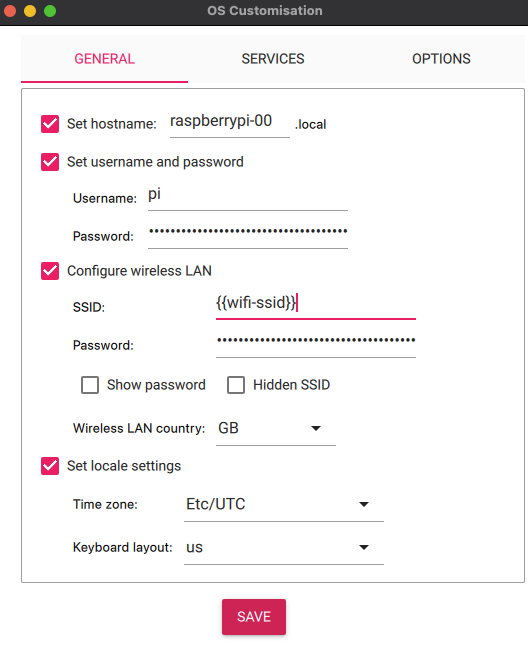
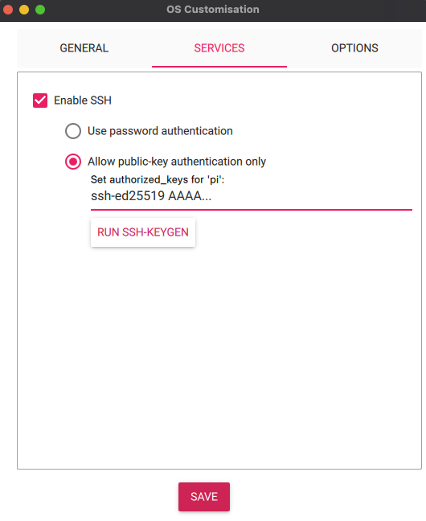

# Create a bootable SD card with Raspberry Pi OS

Raspberry Pi provides [Raspberry Pi Imager](https://www.raspberrypi.com/software/) to create a bootable SD card with Raspberry Pi OS.

1. Install Raspberry Pi Imager

    ```shell
    brew install raspberry-pi-imager
    ```

2. In Raspberry Pi Device, choose `Raspberry Pi 4`.
3. In Operating System, choose `Raspberry Pi OS (other)` -> `Raspberry Pi OS Lite (64 bit)`.
4. In Storage, select the SD card.
5. Click `NEXT`.
6. For OS Customisation, follow the screenshots.

    

    

7. `hostname`, `username`, and the `public-key` are critical for accessing the system via SSH.

  ```shell
  sudo dd if=2023-10-10-raspios-bookworm-arm64-lite.img of=/dev/sdX bs=4M status=progress conv=fsync
  ```
