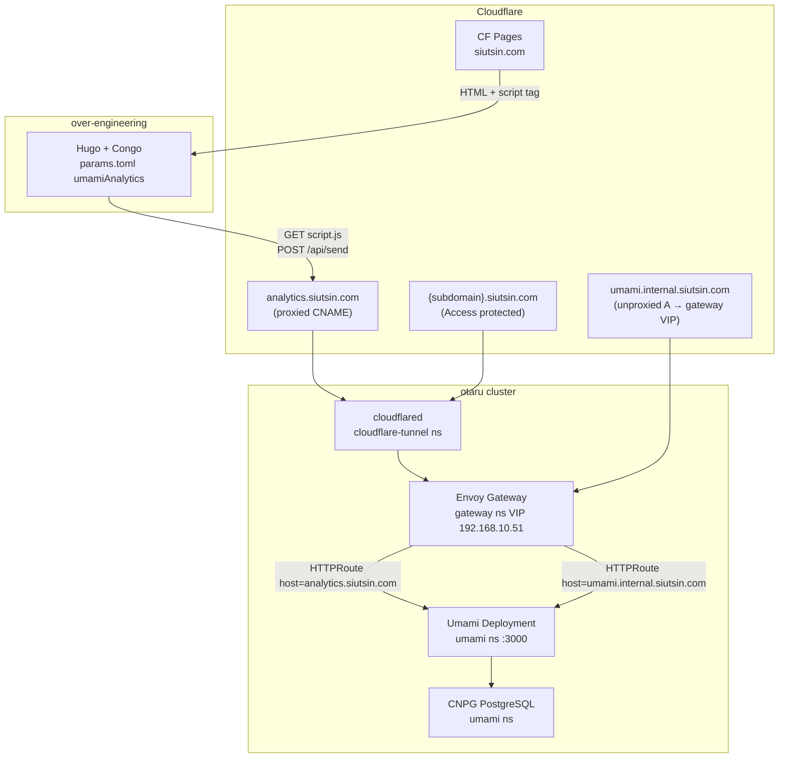
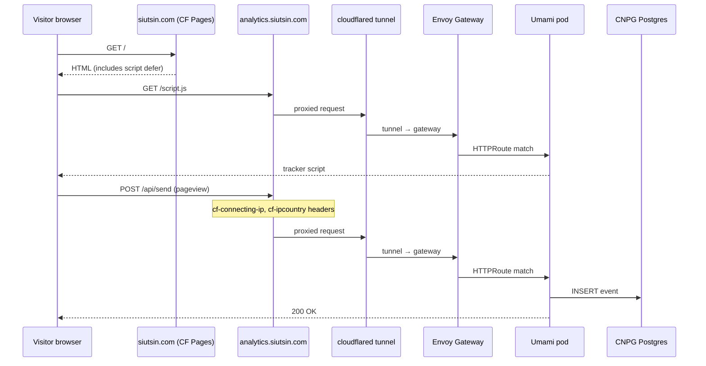
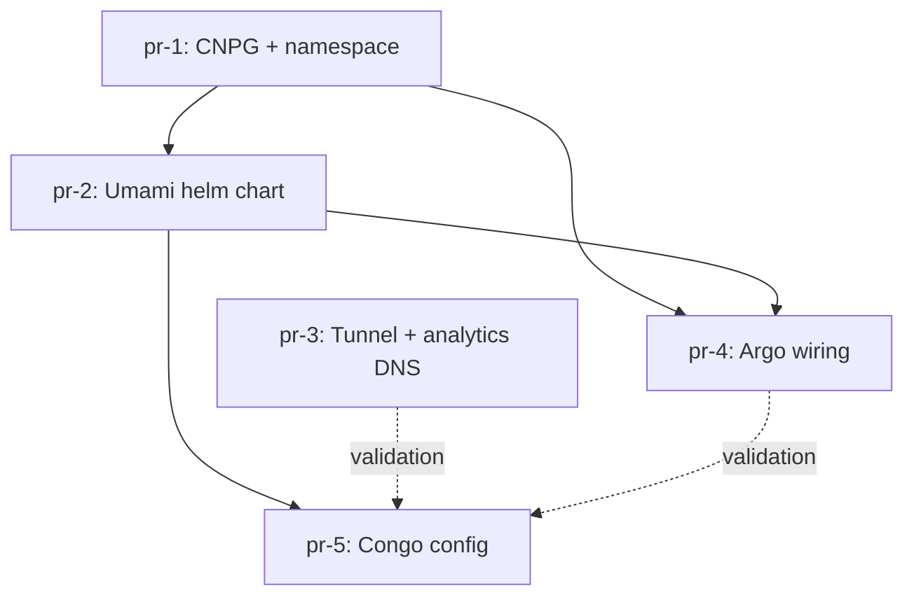

# Self-Hosted Umami Analytics for over-engineering (siutsin.com)

## Metadata

| Field                | Value                                                                                                      |
| -------------------- | ---------------------------------------------------------------------------------------------------------- |
| **Status**           | Proposed                                                                                                   |
| **Author**           | design-doc-writer                                                                                          |
| **Created**          | 2026-06-14                                                                                                 |
| **Repos**            | [otaru](https://github.com/siutsin/otaru), [over-engineering](https://github.com/siutsin/over-engineering) |
| **Consumers**        | Hugo blog at `https://siutsin.com/` (Cloudflare Pages)                                                     |
| **Collect endpoint** | `https://analytics.siutsin.com` (public, no Cloudflare Access)                                             |
| **Dashboard**        | `https://umami.internal.siutsin.com` (internal, unproxied A → gateway VIP)                                 |

---

## Overview

Deploy [Umami](https://umami.is) on the otaru Kubernetes cluster to collect privacy-focused analytics for the
**over-engineering** Hugo blog. The blog stays on Cloudflare Pages; only the analytics collector and dashboard run on
otaru.

**v1 scope:** direct third-party collect hostname (`analytics.siutsin.com`). No Cloudflare Worker first-party proxy on `siutsin.com` yet.

---

## Background

### over-engineering blog

- Repo: `/Users/simon/projects/github/siutsin/over-engineering`
- Hugo + Congo theme v2.14.0 (`github.com/jpanther/congo/v2 v2.14.0`)
- `baseURL = "https://siutsin.com/"` in `config/_default/hugo.toml`
- Deployed on **Cloudflare Pages** (not otaru gateway)
- Privacy policy (`content/privacy-policy.md`) already states Umami is self-hosted on otaru; no third-party analytics vendors

### Congo Umami integration

Congo supports `[umamiAnalytics]` in `config/_default/params.toml`:

```toml
[umamiAnalytics]
site = "<website-uuid>"
script = "https://analytics.siutsin.com/script.js"
```

The theme partial `layouts/_partials/analytics.html` (v2.14.0) injects (only when `hugo.IsProduction`):

```html
<script defer src="{{ .script }}" data-website-id="{{ .site }}"></script>
```

**Important:** Congo sets `data-website-id` only — **not** `data-host-url`. The tracker therefore uses the script origin
(`analytics.siutsin.com`) for API calls. This matches the v1 design (dedicated collect hostname).

Analytics loads only when `hugo.IsProduction` is true (Hugo build with `HUGO_ENV=production` or equivalent CF Pages production build).

### otaru ingress patterns

| Pattern            | Example                                   | Mechanism                                                               |
| ------------------ | ----------------------------------------- | ----------------------------------------------------------------------- |
| Internal dashboard | `jsoncrack.internal.siutsin.com`          | Unproxied A → gateway VIP + `HTTPRoute`; Access on tunnel hostname only |
| Public path route  | `*.siutsin.com/httpbin/`                  | `HTTPRoute` on gateway — **does not apply** to CF Pages apex traffic    |
| Tunnel hostname    | `{CLOUDFLARE_ZONE_SUBDOMAIN}.siutsin.com` | Proxied CNAME → cloudflared → Envoy Gateway                             |

Because `siutsin.com` apex is served by Cloudflare Pages, the Umami collect endpoint **must** use a separate hostname: `analytics.siutsin.com` → tunnel → gateway.

### Existing infrastructure conventions

- **North-south:** Cloudflare (proxied) → cloudflared tunnel → Envoy Gateway (`192.168.10.51`) → `HTTPRoute` → Service
- **Postgres:** CNPG via `helm-charts/cloudnative-pg-clusters/`; `ExternalSecret` generates `DATABASE_URL` with `sslmode=verify-full&sslrootcert=/etc/secrets/ca/ca.crt`
- **Secrets:** 1Password via External Secrets (`ClusterSecretStore` `onepassword-secret-store`)
- **Mesh:** Ambient Istio; `AuthorizationPolicy` allows only gateway ServiceAccount
- **Scheduling:** Light apps prefer `sd-card` nodes; databases exclude `sd-card`
- **GitOps:** Argo CD apps in `argocd/manifest.jsonnet`; namespaces in `helm-charts/namespaces/values.yaml`

---

## Goals

1. Self-host Umami on otaru with CNPG PostgreSQL and encrypted backups (Barman/B2).
2. Expose a **public** collect endpoint at `analytics.siutsin.com` (proxied, no Access) so the CF Pages blog can load `script.js` and POST events cross-origin.
3. Expose an **internal** dashboard at `umami.internal.siutsin.com` via unproxied internal DNS → gateway VIP (same pattern as jsoncrack/happy).
4. Wire the over-engineering blog via Congo `[umamiAnalytics]` with a single website domain `siutsin.com`.
5. Align runtime behaviour with the existing privacy policy (no cookies, no PII, self-hosted).

## Non-Goals (v1)

- Cloudflare Worker first-party proxy (`siutsin.com/u/*` → Umami) — document as future enhancement only.
- Multi-website or multi-tenant Umami setup beyond `siutsin.com`.
- Session Replay, Web Vitals, or other v3.1+ optional tracker features (can enable later in Umami UI).
- Custom Congo theme fork for `data-host-url` (not needed when script and API share `analytics.siutsin.com`).
- HA Postgres (single CNPG instance is sufficient for a personal blog).

---

## Proposed Design

### Architecture



### Collect request flow



### Component summary

| Component             | Namespace | Hostname(s)                      | Notes                                      |
| --------------------- | --------- | -------------------------------- | ------------------------------------------ |
| CNPG cluster          | `umami`   | `umami-YYYYMMDD-HHMM-rw.umami`   | 1 instance, 2 Gi, no sd-card               |
| Umami app             | `umami`   | see routes below                 | Pin image digest; mount CNPG CA            |
| HTTPRoute (collect)   | `umami`   | `analytics.siutsin.com`          | Public; no Access                          |
| HTTPRoute (dashboard) | `umami`   | `umami.internal.siutsin.com`     | Internal; unproxied A → gateway VIP        |
| Tunnel ingress        | N/A       | `analytics.siutsin.com`          | New block before 404 catch-all             |
| DNS (proxied)         | N/A       | `analytics` CNAME                | New record in tunnel module                |
| DNS (unproxied)       | N/A       | `umami.internal` A               | Add to `CLOUDFLARE_DNS_SUBDOMAINS`         |

---

## Per-Component Changes

### 1. Namespace — otaru

**File:** `helm-charts/namespaces/values.yaml`

Add:

```yaml
  - name: umami
```

### 2. CNPG cluster — otaru

**File:** `helm-charts/cloudnative-pg-clusters/values.yaml`

Add cluster entry (name uses date stamp at implementation time):

```yaml
  umami:
    clusterName: umami-20260614-0001
    namespace: umami
    instances: 1
    storage:
      size: 2Gi
      storageClass: longhorn-crypto-global
    affinity:
      podAntiAffinityType: preferred
      nodeAffinity:
        requiredDuringSchedulingIgnoredDuringExecution:
          nodeSelectorTerms:
            - matchExpressions:
                - key: node.siutsin.com/storage-tier
                  operator: NotIn
                  values:
                    - sd-card
    postgresql:
      <<: *postgresql
      pg_hba:
        - hostssl all all 0.0.0.0/0 scram-sha-256
        - hostssl all all ::0/0 scram-sha-256
    enableSuperuserAccess: false
    managed:
      roles:
        - name: app
          ensure: present
          login: true
          connectionLimit: -1
    bootstrap:
      initdb:
        database: umami
        owner: app
        secret:
          name: umami-20260614-0001
    test:
      enabled: true
      query: SELECT 1;
```

**Auto-generated by chart (no extra files):**

- `templates/password-generator.yaml` → Password generator `umami-20260614-0001`
- `templates/external-secret.yaml` → Secret `umami-20260614-0001` in `umami` ns with:
  - `DATABASE_URL=postgresql://app:<password>@umami-20260614-0001-rw.umami:5432/umami?sslmode=verify-full&sslrootcert=/etc/secrets/ca/ca.crt`
  - `DATABASE_USER`, `DATABASE_PASS`, `DATABASE_HOST`, etc.
- CNPG operator secret `umami-20260614-0001-ca` (CA for volume mount)

Uses chart defaults for Postgres resources (512Mi memory) — sufficient for a single-instance personal-blog workload.

### 3. Umami Helm chart (new) — otaru

**Directory:** `helm-charts/umami/`

| File                                  | Purpose                                  |
| ------------------------------------- | ---------------------------------------- |
| `Chart.yaml`                          | `name: umami`, `version: 0.1.0`          |
| `values.yaml`                         | Image, resources, routes, secrets refs   |
| `templates/deployment.yaml`           | Umami container                          |
| `templates/service.yaml`              | ClusterIP :3000                          |
| `templates/external-secret.yaml`      | `APP_SECRET` from 1Password              |
| `templates/authorization-policy.yaml` | Gateway SA only (copy jsoncrack pattern) |
| `templates/route-internal.yaml`       | `umami.internal.siutsin.com`             |
| `templates/route-collect.yaml`        | `analytics.siutsin.com`                  |
| `templates/pdb.yaml`                  | `minAvailable: 0` (single replica)       |

**`values.yaml` (proposed):**

```yaml
name: umami
namespace: umami

image:
  repository: ghcr.io/umami-software/umami
  tag: postgresql-v3.1.0@sha256:<pin-at-implementation>
  pullPolicy: IfNotPresent

database:
  secretName: umami-20260614-0001
  caSecretName: umami-20260614-0001-ca

appSecret:
  externalSecret:
    refreshInterval: 24h
    secretStoreRef:
      kind: ClusterSecretStore
      name: onepassword-secret-store
    remoteRef:
      key: umami
      property: APP_SECRET

service:
  port: 3000
  targetPort: 3000

deployment:
  replicas: 1
  resources:
    requests:
      cpu: 50m
      memory: 256Mi
      ephemeral-storage: 256Mi
    limits:
      memory: 512Mi
      ephemeral-storage: 512Mi

routes:
  collect:
    hostname: analytics.siutsin.com

gateway:
  name: gateway
  namespace: gateway

env:
  TZ: Europe/London
```

**`deployment.yaml` highlights:**

- `envFrom`: secret `umami-20260614-0001` → `DATABASE_URL`
- `env`: `APP_SECRET` from ExternalSecret target secret `umami`
- Volume mount: `umami-20260614-0001-ca` → `/etc/secrets/ca` (readOnly) for `sslrootcert` path in `DATABASE_URL`
- Probes: `GET /api/heartbeat` on port `http`
- Affinity: **prefer** `sd-card` nodes (jsoncrack pattern)
- `automountServiceAccountToken: false`
- `reloader.stakater.com/auto: "true"` on Deployment

**`route-collect.yaml`:**

```yaml
hostnames:
  - analytics.siutsin.com
parentRefs:
  - group: gateway.networking.k8s.io
    kind: Gateway
    name: gateway
    namespace: gateway
rules:
  - matches:
      - path:
          type: PathPrefix
          value: /
    backendRefs:
      - group: ""
        kind: Service
        name: umami
        port: 3000
        weight: 1
```

**`route-internal.yaml`:** Same as jsoncrack `route-internal.yaml` — hostname from `{{ printf "%s.internal.siutsin.com" .Values.name }}` with `name: umami`.

### 3b. Envoy Gateway namespace allowlist — otaru

**File:** `helm-charts/envoy-gateway/templates/gateway.yaml`

Add `umami` to both HTTPS and HTTP listener `allowedRoutes.namespaces.selector.matchExpressions` lists (alongside `jsoncrack`, `happy`, `teslamate`, etc.):

```yaml
# HTTPS listener (after teslamate):
                  - umami
# HTTP listener (after teslamate):
                  - umami
```

Without this change, HTTPRoutes in namespace `umami` cannot attach to the Gateway.

### 4. Cloudflare tunnel + DNS — otaru

**File:** `infrastructure/modules/cloudflare-tunnel/tunnel.tf`

Insert **before** the `http_status:404` catch-all:

```hcl
{
  hostname = "analytics.${var.zone}"
  service  = var.gateway_service
},
```

**File:** `infrastructure/modules/cloudflare-tunnel/dns.tf`

Add proxied CNAME:

```hcl
resource "cloudflare_dns_record" "analytics" {
  zone_id = var.zone_id
  content = local.tunnel_hostname
  name    = "analytics"
  proxied = true
  ttl     = 1
  type    = "CNAME"
}
```

**No Cloudflare Access application** for `analytics.siutsin.com` — the collect endpoint must be reachable by anonymous browsers.

**Manual env update** (`~/dotfiles/secrets/otaru/envrc`):

```shell
export CLOUDFLARE_DNS_SUBDOMAINS='[..., "umami.internal"]'
```

Apply via `infrastructure/cloud/cloudflare/dns/terragrunt.hcl`.

### 5. Argo CD wiring — otaru

**File:** `argocd/manifest.jsonnet`

Add to `application` list (wave 10 for Umami app, after cloudnative-pg-clusters wave 06):

```jsonnet
{ wave: '10', name: 'umami', namespace: 'umami' },
```

The `umami` chart deploys the app; CNPG cluster is part of existing `cloudnative-pg-clusters` app.

### 6. 1Password secret (manual)

**Item:** `umami` in the vault used by `onepassword-secret-store`

| Field        | Usage                                          |
| ------------ | ---------------------------------------------- |
| `APP_SECRET` | Umami session/crypto secret (≥32 random bytes) |

CNPG `DATABASE_URL` password is auto-generated by External Secrets Password generator — **not** stored in 1Password.

### 7. over-engineering Congo config

**File:** `over-engineering/config/_default/params.toml`

Add:

```toml
[umamiAnalytics]
site = "00000000-0000-0000-0000-000000000000"  # replace after Umami UI setup
script = "https://analytics.siutsin.com/script.js"
```

Use placeholder UUID in PR; replace with real website UUID after manual Umami setup.

**No changes** to `privacy-policy.md` — already accurate.

**Optional future:** `layouts/_partials/analytics-umami.html` override if first-party proxy is added later.

---

## Security & Privacy

Aligned with `over-engineering/content/privacy-policy.md`:

| Claim                                 | Implementation                                                          |
| ------------------------------------- | ----------------------------------------------------------------------- |
| Self-hosted, no third-party analytics | Umami runs entirely on otaru; data stored in CNPG on Longhorn           |
| No cookies                            | Umami default tracker uses no cookies                                   |
| No PII / no cross-session tracking    | Umami hashes visitor IDs; no user accounts on public site               |
| Country detection                     | Umami reads `cf-ipcountry` from Cloudflare-proxied collect requests     |
| IP handling                           | Umami reads `cf-connecting-ip`; stored hashed/salted per Umami defaults |

**Additional controls:**

- **Dashboard:** `umami.internal.siutsin.com` uses unproxied internal DNS → gateway VIP (jsoncrack/happy pattern).
  Cloudflare Access applies to the tunnel hostname (`{CLOUDFLARE_ZONE_SUBDOMAIN}.siutsin.com`), not to
  `*.internal.siutsin.com` directly. Remote admin from outside the LAN uses cluster IP bypass or VPN; on-LAN access
  hits the gateway VIP without Access.
- **Collect endpoint:** Public by design; limited to Umami's read-only tracker script and `POST /api/send`. No admin UI
  exposure required on `analytics.siutsin.com` (Umami serves both on same app — acceptable for v1; rate limiting
  deferred).
- **Mesh:** `AuthorizationPolicy` restricts Umami Service to gateway ServiceAccount only.
- **Secrets:** `APP_SECRET` in 1Password; DB password rotated by External Secrets (24h refresh).
- **Telemetry / geo data:** Upstream image `ghcr.io/umami-software/umami:postgresql-v3.1.0` is pre-built;
  `DISABLE_TELEMETRY` and `SKIP_BUILD_GEO` are build-time only (no runtime env vars needed).
- **Postgres:** TLS `verify-full` with mounted CA; scram-sha-256 auth.
- **Default credentials:** Umami ships `admin` / `umami` — **must change on first login**.

**Cloudflare Pages caveat (documented in privacy policy):** CF Pages may process request metadata independently of Umami. Umami only receives data from the tracker loaded on the client.

---

## Rollout Plan

### Phase 0 — Prerequisites

1. Confirm `cloudnative-pg` and `cloudnative-pg-clusters` apps healthy in Argo CD.
2. Create 1Password item `umami` with field `APP_SECRET` (e.g. `openssl rand -base64 32`).

### Phase 1 — Infrastructure PRs (otaru)

1. Merge **pr-1** (namespace + CNPG cluster).
2. Wait for Argo sync; verify CNPG cluster `umami-20260614-0001` is healthy:

   ```bash
   kubectl get cluster -n umami
   kubectl get externalsecret -n umami
   ```

3. Merge **pr-3** (tunnel + analytics DNS); apply Terraform:

   ```bash
   cd infrastructure/cloud/cloudflare/tunnel && terragrunt apply
   ```

4. Add `umami.internal` to `CLOUDFLARE_DNS_SUBDOMAINS`; apply DNS:

   ```bash
   cd infrastructure/cloud/cloudflare/dns && terragrunt apply
   ```

5. Merge **pr-2** (Umami helm chart) then **pr-4** (Argo wiring).
6. Verify pods:

   ```bash
   kubectl get pods -n umami
   curl -sf https://analytics.siutsin.com/api/heartbeat
   ```

### Phase 2 — Umami UI setup (manual)

1. Open `https://umami.internal.siutsin.com` (on LAN via gateway VIP, or remotely via cluster IP bypass / VPN).
2. Login with default `admin` / `umami`.
3. **Immediately** change admin password (Settings → Profile).
4. Add website:
   - **Name:** `siutsin.com`
   - **Domain:** `siutsin.com`
5. Copy the website **UUID** from Settings → Websites.

### Phase 3 — Blog wiring (over-engineering)

1. Merge **pr-5** with real UUID (or update placeholder after merge).
2. CF Pages rebuilds production site automatically on push to default branch.
3. Verify in browser DevTools (production build):
   - `script.js` loads from `analytics.siutsin.com`
   - `POST /api/send` returns 200
4. Confirm pageview appears in Umami dashboard.

### Phase 4 — Validation checklist

- [ ] `make test` passes in otaru
- [ ] `curl https://analytics.siutsin.com/api/heartbeat` returns `{"status":"ok"}`
- [ ] `umami.internal.siutsin.com` resolves via unproxied A record and serves dashboard on LAN
- [ ] Blog production build loads tracker (not on Hugo dev server unless `HUGO_ENV=production`)
- [ ] CNPG backup job runs (existing Barman schedule)
- [ ] Admin password changed from default

---

## Future Enhancements

### First-party collect proxy (v2)

Serve the tracker from the same origin as the blog to reduce third-party script blocking:

```text
siutsin.com/u/script.js  → CF Worker → analytics.siutsin.com/script.js
siutsin.com/u/api/send   → CF Worker → analytics.siutsin.com/api/send
```

Would require:

- Cloudflare Worker in the `siutsin.com` zone (Pages project or separate worker route)
- Congo theme override adding `data-host-url="https://siutsin.com/u"` or custom partial
- Worker CORS and caching rules

Deferred from v1 intentionally.

---

## PR Plan DAG



### pr-1: CNPG umami cluster + namespace

- **Branch**: `feat/umami-cnpg-namespace`
- **Repos**: otaru
- **Depends on**: none
- **Files**:
  - `helm-charts/namespaces/values.yaml` — add `umami` namespace
  - `helm-charts/cloudnative-pg-clusters/values.yaml` — add `umami` cluster entry (`umami-20260614-0001`,
    `postgresql: <<: *postgresql` + scram `pg_hba`, `bootstrap.initdb.secret.name`, 2Gi, exclude sd-card)
- **Acceptance criteria**:
  - `helm template` for `cloudnative-pg-clusters` renders Cluster + Password + ExternalSecret for `umami`
  - Cluster spec includes `bootstrap.initdb.secret.name: umami-20260614-0001` matching ExternalSecret target
  - `make test` passes
  - After Argo sync: CNPG Cluster `Ready`, PostSync test job succeeds
- **Test command**: `make test`

### pr-2: Umami helm chart

- **Branch**: `feat/umami-helm-chart`
- **Repos**: otaru
- **Depends on**: pr-1
- **Files**:
  - `helm-charts/umami/Chart.yaml`
  - `helm-charts/umami/values.yaml`
  - `helm-charts/umami/templates/deployment.yaml`
  - `helm-charts/umami/templates/service.yaml`
  - `helm-charts/umami/templates/external-secret.yaml` — 1Password key `umami`, property `APP_SECRET`
  - `helm-charts/umami/templates/authorization-policy.yaml`
  - `helm-charts/umami/templates/route-internal.yaml` — host `umami.internal.siutsin.com` (jsoncrack `printf` pattern)
  - `helm-charts/umami/templates/route-collect.yaml` — host `analytics.siutsin.com`
  - `helm-charts/umami/templates/pdb.yaml`
  - `helm-charts/envoy-gateway/templates/gateway.yaml` — add `umami` to HTTPS and HTTP `allowedRoutes` namespace lists
- **Acceptance criteria**:
  - Image pinned: `ghcr.io/umami-software/umami:postgresql-v3.1.0@sha256:...`
  - `helm template helm-charts/envoy-gateway` shows `umami` in HTTPS and HTTP allowed namespace lists
  - Deployment mounts `{clusterName}-ca` at `/etc/secrets/ca`
  - `DATABASE_URL` sourced from CNPG ExternalSecret; `APP_SECRET` from 1Password ExternalSecret
  - Probes hit `/api/heartbeat`
  - `helm template helm-charts/umami` renders without error
  - `make test` passes
- **Test command**: `make test`

### pr-3: Cloudflare tunnel analytics hostname + DNS

- **Branch**: `feat/umami-analytics-tunnel-dns`
- **Repos**: otaru
- **Depends on**: none
- **Files**:
  - `infrastructure/modules/cloudflare-tunnel/tunnel.tf` — ingress block `analytics.${var.zone}` → `var.gateway_service`
  - `infrastructure/modules/cloudflare-tunnel/dns.tf` — proxied CNAME `analytics` → tunnel hostname
- **Acceptance criteria**:
  - `terragrunt hcl validate` / `make test` passes
  - `terragrunt plan` shows new ingress rule and DNS record only
  - After apply: `dig analytics.siutsin.com` resolves to tunnel; no Access policy on this hostname
- **Test command**: `make test`

### pr-4: Argo wiring

- **Branch**: `feat/umami-argocd`
- **Repos**: otaru
- **Depends on**: pr-1, pr-2
- **Files**:
  - `argocd/manifest.jsonnet` — add `{ wave: '10', name: 'umami', namespace: 'umami' }`
- **Acceptance criteria**:
  - `make test` passes (includes `validate-argocd-manifest`)
  - Argo CD Application `umami` syncs Healthy
  - HTTPRoutes attached to gateway; Service endpoints ready
- **Test command**: `make test`

### pr-5: over-engineering Congo config

- **Branch**: `feat/umami-analytics`
- **Repos**: over-engineering
- **Depends on**: pr-2 (Congo config merge); end-to-end validation also requires pr-3, pr-4, and manual UUID from Umami UI
- **Files**:
  - `config/_default/params.toml` — add `[umamiAnalytics]` with `site` (UUID) and `script = "https://analytics.siutsin.com/script.js"`
- **Acceptance criteria**:
  - Production Hugo build includes Umami script tag with correct `data-website-id`
  - Pageview from `https://siutsin.com/` appears in Umami dashboard for website `siutsin.com`
  - No tracker in non-production builds (`hugo server` without production env)
- **Test command**: `hugo --environment production && grep -r 'analytics.siutsin.com' public/`

---

## Open Questions

1. **Image digest:** Pin `postgresql-v3.1.0` digest at PR-2 implementation time (fetch from `ghcr.io/umami-software/umami`).
2. **Umami resource limits:** Start with 256Mi request / 512Mi limit; adjust if Prisma migrations on startup OOM.
3. **Collect hostname hardening:** Whether to add Cloudflare WAF rate limiting on `analytics.siutsin.com` post-launch.
4. **CORS verification:** Confirm Umami v3.1.0 accepts `Origin: https://siutsin.com` on `/api/send` without extra env vars (expected yes; validate in Phase 3).
5. **Cluster name date stamp:** Use `umami-YYYYMMDD-HHMM` at merge time (matches teslamate naming convention).

---

## Revision Summary

Changes from design review (`grok-design-review-umami.md`, 2026-06-14):

1. **Gateway allowlist (critical):** Added section 3b and pr-2 file/acceptance criteria for
   `helm-charts/envoy-gateway/templates/gateway.yaml` — `umami` in HTTPS and HTTP `allowedRoutes` namespace lists.
2. **CNPG `postgresql` merge (major):** Cluster entry now uses `postgresql: <<: *postgresql` with `pg_hba` override
   (teslamate pattern) instead of replacing defaults.
3. **CNPG bootstrap secret (major):** Added `bootstrap.initdb.secret.name: umami-20260614-0001` so initdb credentials
   match ExternalSecret `DATABASE_URL`.
4. **Markdownlint (major):** Fixed all markdownlint violations so `make test` `check-markdown` passes.
5. **Build-time env vars (minor):** Removed `SKIP_BUILD_GEO` and `DISABLE_TELEMETRY` from runtime `env`; documented as
   build-time-only in upstream image.
6. **Internal Access wording (minor):** Clarified `umami.internal.siutsin.com` uses unproxied A → gateway VIP
   (jsoncrack pattern); Access applies to tunnel hostname only.
7. **`route-collect` backendRefs (minor):** Added `group`, `kind`, and `weight` fields to match jsoncrack/happy
   templates.
8. **Argo wave comment (nit):** Corrected to "wave 10 for Umami app, after cloudnative-pg-clusters wave 06".
9. **PR DAG (minor):** Added `pr3 -.-> pr5` and `pr4 -.-> pr5` validation dependencies.
10. **CNPG memory (minor):** Dropped custom 256Mi override; uses chart defaults (512Mi) with rationale.
11. **`route-internal` template (nit):** Documented jsoncrack `printf` hostname pattern instead of explicit
    `routes.internal.hostname`.
12. **Congo partial (nit):** Noted `hugo.IsProduction` guard in analytics partial description.
