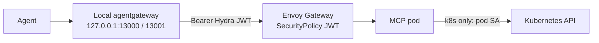

# MCP authentication

Machine clients reach cluster MCP servers through short-lived OAuth access
tokens. Edge JWT answers who may call MCP. Workload identity answers what the
server may do in the cluster. Those trust domains stay separate.

## Layers

| Layer   | Control                                                                | Answers                           |
|---------|------------------------------------------------------------------------|-----------------------------------|
| Edge    | Envoy Gateway `SecurityPolicy` on each MCP `HTTPRoute`                 | Who may open an MCP session       |
| Mesh    | Istio `AuthorizationPolicy` on the Service (gateway SA for ingress)    | Which principals may reach it     |
| Policy  | Kyverno `require-security-policy` on new `HTTPRoute`s                  | No unauthenticated routes slip in |
| Cluster | Pod ServiceAccount and RBAC (`cluster_auth_mode = kubeconfig` for k8s) | What MCP may do after connect     |

Hydra issues tokens for client `otaru-mcp` (scope `mcp`, ES256
`private_key_jwt`). Public JWKs live under `jwks/`. Private keys never enter
Git or the cluster.

## Request path



1. Local agents talk only to agentgateway on the workstation
  (`13000` Kubernetes MCP, `13001` UniFi MCP).
2. Agentgateway mints or injects a short-lived Hydra access token and proxies
  to the internal hostname.
3. Envoy Gateway validates issuer, JWKS, subject, and scope, then forwards to
  the MCP Service.
4. Kubernetes MCP uses the pod ServiceAccount for apiserver calls. It does not
  treat the Hydra Bearer as a kube credential.
5. UniFi MCP uses its own controller credentials; the edge JWT is only for
  HTTP access.

Without a valid JWT, the public or internal hostname returns `401`. Network
location alone is not enough.

## In-cluster pieces

| Piece          | Location                                     | Role                                 |
|----------------|----------------------------------------------|--------------------------------------|
| Hydra          | `helm-charts/hydra`, host `auth.siutsin.com` | Token issuer and JWKS                |
| K8s MCP        | `helm-charts/kubernetes-mcp-server`          | Cluster tools; SA-backed kube client |
| UniFi MCP      | `helm-charts/unifi-mcp`                      | UniFi Network tools                  |
| SecurityPolicy | per MCP chart                                | JWT on the internal HTTPRoute        |
| Kyverno        | `helm-charts/kyverno-policy`                 | Require SecurityPolicy on HTTPRoutes |
| Mint helper    | `hack/mint-otaru-mcp-token.py`               | Offline `client_credentials` mint    |

Kubernetes MCP config sets:

```toml
cluster_auth_mode = "kubeconfig"
cluster_provider_strategy = "in-cluster"
```

The ServiceAccount is bound to a read-mostly agent ClusterRole with limited
write (workloads and Argo Applications), not `cluster-admin`.

## Workstation pieces

These live in personal dotfiles, not this repo:

- LaunchAgent `com.siutsin.agentgateway` (`RunAtLoad`, `KeepAlive`)
- LaunchAgent `com.siutsin.otaru-mcp-token` (refresh about every 10 minutes)
- Token cache file used as agentgateway `backendAuth` Bearer
- Private key path for minting (`OTARU_MCP_KEY`)

Agents should point MCP URLs at `http://127.0.0.1:13000/mcp` and
`http://127.0.0.1:13001/mcp` only. They should not hold Hydra tokens or call
the cluster hostnames directly.

After login, LaunchAgents start again. After a token refresh, restart
agentgateway if upstream returns `Jwt is expired` while the cache file is
already fresh (stale in-process token).

## Related docs

- [Architecture diagram](../assets/architecture.png) — cluster-wide layout including MCP
- [Connectivity](connectivity.md) — north-south path through Envoy Gateway
- [Secrets](secrets.md) — Hydra server secrets and client key handling
- [Public JWKS](../jwks/README.md) — committed public keys only
- [Gotchas](gotcha.md) — operational pitfalls for MCP clients
